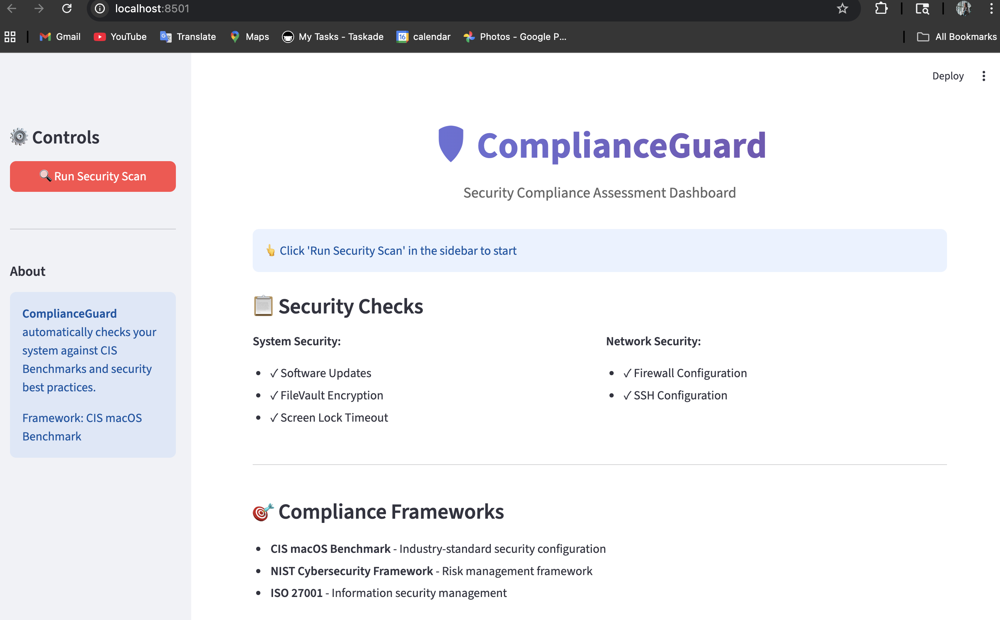
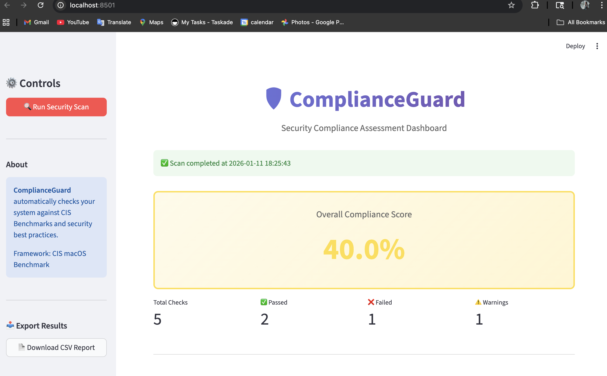
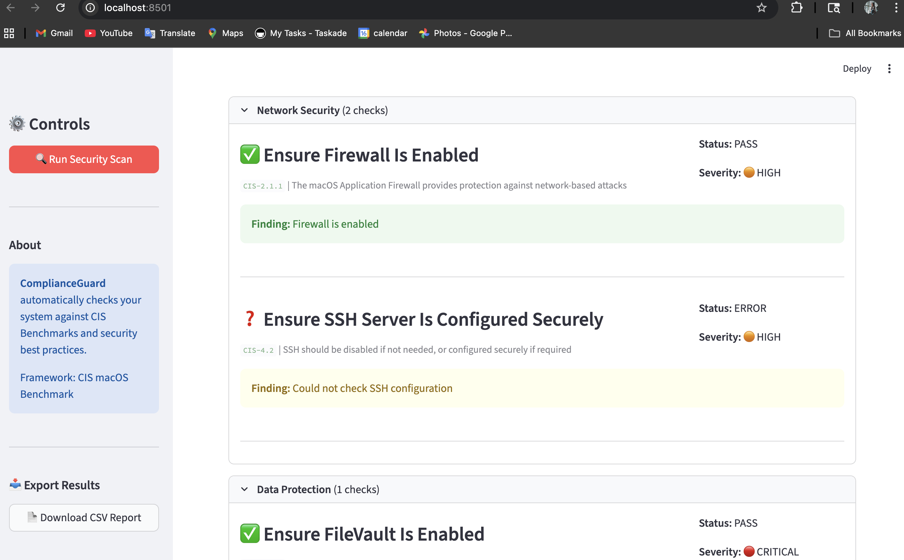

# ComplianceGuard

**Automated Security Compliance Scanner for macOS**

ComplianceGuard is a Python-based security compliance assessment tool that automatically checks macOS systems against CIS Benchmarks and industry security best practices. Built for security professionals, IT auditors, and compliance teams.



---

## Features

### Automated Security Checks
- **System Updates** - Verifies all Apple software is current
- **Firewall Configuration** - Ensures network protection is enabled
- **FileVault Encryption** - Validates full disk encryption status
- **Screen Lock Timeout** - Checks automatic screen lock settings
- **SSH Configuration** - Audits remote access security

### Interactive Dashboard
- Real-time compliance scoring
- Visual status indicators
- Detailed findings by category
- Risk assessments and remediation guidance
- CSV export for reporting

### Compliance Frameworks
- **CIS macOS Benchmark** - Industry-standard security configuration
- **NIST Cybersecurity Framework** - Risk management controls
- **ISO 27001** - Information security management standards

---

## Quick Start

### Prerequisites
- macOS 12.0 or later
- Python 3.8+
- Admin/sudo privileges for some checks

### Installation
```bash
# Clone the repository
git clone https://github.com/Itstwisha/complianceguard.git
cd complianceguard

# Create virtual environment
python3 -m venv venv
source venv/bin/activate

# Install dependencies
pip install -r requirements.txt
```

### Usage

#### Option 1: Interactive Dashboard (Recommended)
```bash
streamlit run dashboard.py
```
Opens web dashboard at `http://localhost:8501`

#### Option 2: Command Line
```bash
# Run all checks with detailed output
sudo python3 test_all_checks.py
```

---

## Screenshots

### Dashboard Overview


### Compliance Score


### Detailed Results


---

## Project Structure
```
complianceguard/
├── src/
│   ├── checks/                    # Security check modules
│   │   ├── system/                # System-level checks
│   │   │   ├── software_updates.py
│   │   │   └── filevault_check.py
│   │   ├── network/               # Network security checks
│   │   │   ├── firewall_check.py
│   │   │   └── ssh_config_check.py
│   │   ├── access_control/        # Access control checks
│   │   │   └── screen_lock_check.py
│   │   └── base_check.py          # Base check class
│   ├── core/                      # Core utilities
│   │   └── config_loader.py
│   └── reporting/                 # Report generators
│       └── html_report.py
├── dashboard.py                   # Streamlit dashboard
├── test_all_checks.py            # CLI runner
├── config.yaml                    # Configuration
└── requirements.txt               # Dependencies
```

---

## Configuration

Edit `config.yaml` to customize:
```yaml
scanning:
  frameworks:
    - cis_macos
  severity_levels:
    - CRITICAL
    - HIGH
    - MEDIUM
    - LOW

scoring:
  passing_threshold: 80
  severity_weights:
    CRITICAL: 4
    HIGH: 3
    MEDIUM: 2
    LOW: 1
```

---

## Security Checks Explained

### CIS-1.1: Software Updates
- **What it checks:** System patch status
- **Why it matters:** Outdated software contains known vulnerabilities
- **Fix:** `System Settings → Software Update`

### CIS-2.1.1: Firewall
- **What it checks:** Application firewall status
- **Why it matters:** Protects against network-based attacks
- **Fix:** `System Settings → Network → Firewall → ON`

### CIS-2.6.1: FileVault
- **What it checks:** Full disk encryption status
- **Why it matters:** Protects data if device is lost/stolen
- **Fix:** `System Settings → Privacy & Security → FileVault`

### CIS-5.9: Screen Lock
- **What it checks:** Automatic screen lock timeout
- **Why it matters:** Prevents unauthorized physical access
- **Fix:** `System Settings → Lock Screen → 20 min or less`

### CIS-4.2: SSH Configuration
- **What it checks:** Remote access security settings
- **Why it matters:** Insecure SSH allows unauthorized access
- **Fix:** Disable SSH or configure securely in `/etc/ssh/sshd_config`

---

## Use Cases

### For Security Teams
- Automate compliance assessments
- Generate audit-ready reports
- Track security posture over time
- Identify configuration drift

### For IT Administrators
- Validate system hardening
- Pre-deployment security checks
- Onboarding/offboarding audits
- Policy enforcement verification

### For Compliance Officers
- CIS Benchmark compliance reporting
- Risk assessment documentation
- Control effectiveness evidence
- Executive dashboard reporting

---

## Development

### Adding New Checks

1. Create check class inheriting from `BaseCheck`
2. Implement the `check()` method
3. Define metadata (ID, title, severity, frameworks)
4. Add to scanner in `test_all_checks.py`

Example:
```python
from src.checks.base_check import BaseCheck, CheckStatus, Severity

class MyCustomCheck(BaseCheck):
    def __init__(self):
        super().__init__()
        self.id = "CUSTOM-001"
        self.title = "My Security Check"
        self.severity = Severity.HIGH
    
    def check(self):
        # Implement check logic
        return {
            'status': CheckStatus.PASS,
            'finding': 'Check passed',
            'risk': 'None'
        }
```

### Running Tests
```bash
# Test individual check
python3 src/checks/system/software_updates.py

# Test all checks
sudo python3 test_all_checks.py
```

---

## Sample Output
```
ComplianceGuard - Running All Checks

Running: Ensure All Apple-Provided Software Is Current
  ❌ FAIL: 0 update(s) available

Running: Ensure Firewall Is Enabled
  ✅ PASS: Firewall is enabled

Summary:
┌───────────┬─────────────────────────────────┬─────────┬──────────┐
│ ID        │ Check                           │ Status  │ Severity │
├───────────┼─────────────────────────────────┼─────────┼──────────┤
│ CIS-1.1   │ Ensure All Apple-Provided...    │ ❌ FAIL │ HIGH     │
│ CIS-2.1.1 │ Ensure Firewall Is Enabled      │ ✅ PASS │ HIGH     │
└───────────┴─────────────────────────────────┴─────────┴──────────┘

Compliance Score: 40.0%
```

---

## Roadmap

- [ ] Add Linux support (Ubuntu/RHEL)
- [ ] Windows security checks
- [ ] Scheduled scanning with cron
- [ ] Email alert notifications
- [ ] Historical trend analysis
- [ ] API for CI/CD integration
- [ ] Additional compliance frameworks (PCI-DSS, HIPAA)

---

## Contributing

Contributions welcome! Please:
1. Fork the repository
2. Create a feature branch
3. Add tests for new checks
4. Submit a pull request

---

## License

MIT License - see LICENSE file for details

---

## Author

**Twisha Sharma**
- GitHub: [@Itstwisha](https://github.com/Itstwisha)
- LinkedIn: [twisha-sharma](https://linkedin.com/in/twisha-sharma)

---

## Acknowledgments

- CIS Benchmarks for macOS security standards
- NIST Cybersecurity Framework
- Python security community

---

## Support

Having issues? Please [open an issue](https://github.com/Itstwisha/complianceguard/issues)

---

** If you find this tool useful, please star the repository!**
